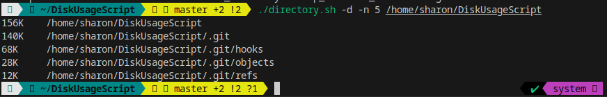
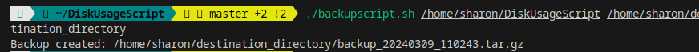

# BashScripting Assignment 
Over the last month we have been learning Bash Scripting as part of Cloud Engineering Course. This project represent an assignment for:


## Shell Scripting for Disk Usage
 - writing a shell script to list 5 directories with a given folder path with the storage size and its path. 




## BackUp Script 
- Writing a backup script that creates a backup file in a given destination and creates backup filename using the given timestamp

### How to Execute the DiskUsage Script

```
mkdir scripts_folder
cd scripts_folder
vim directory.sh
// write script

chmod +x directory.sh
pwd // to know the /path/to/current_directory
./directory.sh -d -n 5 /path/to/current_directory
```



### How to Execute the Backup Script 
```
mkdir scripts_folder
cd scripts_folder
vim backupscript.sh
cd scripts_folder
$ chmod +x backupscript.sh
$ ./backupscript.sh /home/sharon/DiskUsageScript /path/to/destination_directory
```

## Tools
- Vim  
